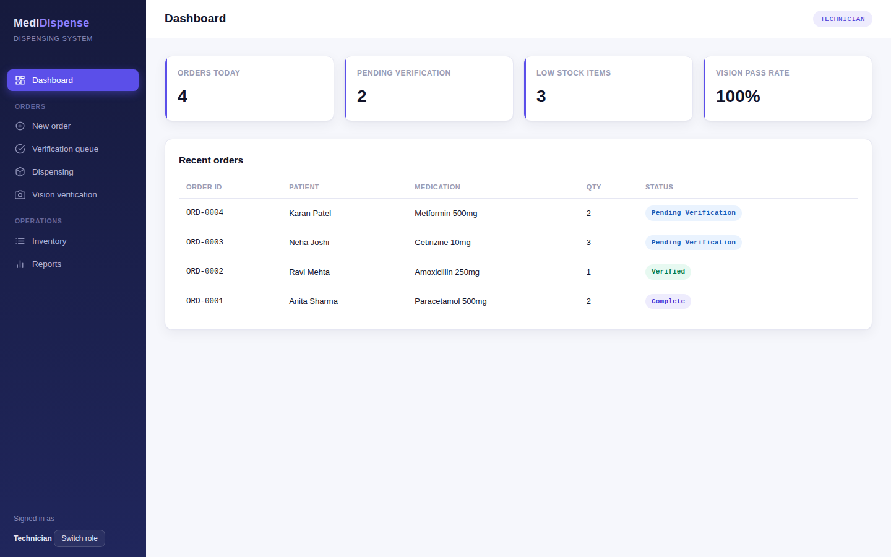
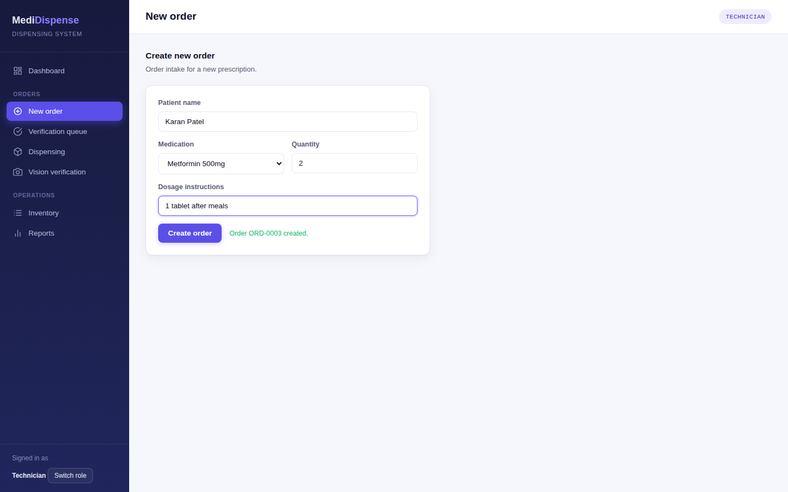
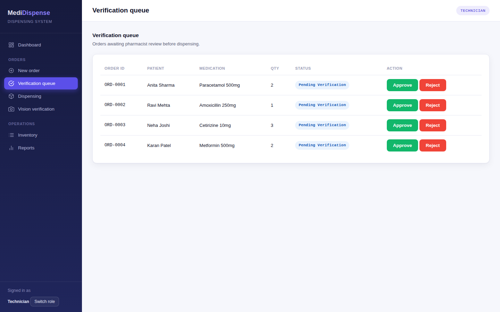
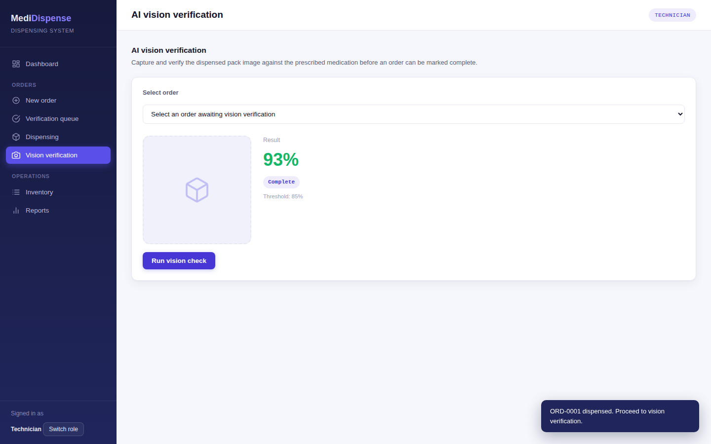

# MediDispense — QA Portfolio

**Manual QA project simulating a real pharmacy dispensing system — from requirements through 101 test cases, API/DB validation, and an AI vision verification module.**



---

## What's in this repo

- 📋 **101 professional test cases** across 40 test scenarios, mapped to requirements and risk analysis
- 🧪 A clickable **demo application** (`05-Demo-App`) built to execute real tests against — not just theoretical test cases
- 🐞 **Real bug reports** written from actual defects found while testing the demo app
- 🔌 **Postman collection** — 8 REST endpoints, automated test scripts (`pm.test`), and saved success/failure example responses
- 🗄️ **SQL validation against a real SQLite database** — executed queries surfaced 3 real defects (see below)
- 📊 Test execution reports, bug metrics dashboard, and release checklist
- 🤖 A test scope that includes an **AI vision verification feature** — testing an AI-driven pack-image match/reject flow, not just standard CRUD forms

## The product being tested

MediDispense is a fictional pharmacy order and automated dispensing system. Pharmacy staff create and verify prescription orders, dispense medication, and — before an order can be marked complete — an AI vision check verifies that the dispensed pack actually matches the prescription.

This scenario is modeled on real pharmacy automation workflows, not a generic tutorial app (no "Amazon login" testing here).

| | |
|---|---|
|  |  |
|  | |

## Real defect caught by SQL validation

Query executed against `07-Database-Testing/MediDispense.db`:

```sql
SELECT verification_id, order_id, confidence_score, match_status
FROM vision_verification_log
WHERE confidence_score <= 85
  AND match_status = 'Verified';
```

**Result:**

| verification_id | order_id | confidence_score | match_status |
|---|---|---|---|
| 6 | 10 | 70.0 | Verified |

This order's AI vision check returned a 70% confidence score — below the documented 85% threshold — but was still marked "Verified" instead of "Rejected." Full execution log with 2 more defects: [`Validation-Execution-Log.md`](07-Database-Testing/Validation-Execution-Log.md)

## Repository structure

| Folder | Contents |
|---|---|
| `01-Requirements` | Software Requirements Specification |
| `02-Test-Strategy-Plan` | Test Strategy and Test Plan |
| `03-Risk-Analysis` | Risk assessment and mitigation-driven test prioritization |
| `04-Test-Scenarios-Cases` | 40 test scenarios → 101 detailed test cases (Excel) |
| `05-Demo-App` | Clickable demo application used for real test execution |
| `06-API-Testing` | Postman collection for all REST endpoints |
| `07-Database-Testing` | SQL validation queries |
| `08-Bug-Reports` | Real bug reports found while executing tests against the demo app |
| `09-Test-Execution-Reports` | Execution tracking and test summary report |
| `10-Release-Checklist` | Pre-release verification checklist |

## Skills demonstrated

Manual/Functional Testing · Regression & Smoke Testing · API Testing (Postman) · SQL/Database Validation · Test Case Design · Risk-Based Testing · Bug Reporting & Severity/Priority Classification · STLC · Requirement Traceability

## About

Built by **Rishika Lanjewar** — Product QA Engineer with experience in healthcare/pharmacy automation software.
[LinkedIn](https://www.linkedin.com/in/rishika-lanjewar-931209192/)
